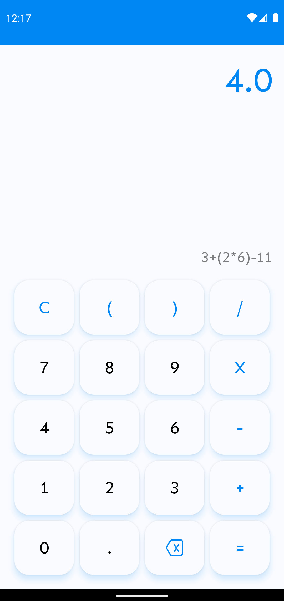

# Calculator

 

# 👋🏻 Welcome!!
This is a simple project that aims to implement a simple Calculator application for Android using Kotlin Programming Language. It contains the simple and basic arithmetic operations. It allows users to perform addition, subtraction, multiplication, and division calculations on their mobile devices.

 

# 🔥 Features
### Arithmetic Operations:
- Addition.
- Subtraction.
- Multiplication.
- Division.

### User Input:
- Numeric Keypad: Allows users to input numbers using a virtual keypad.
- Decimal Point: Enables users to input decimal numbers for precise calculations.

### Calculation Results:
- Display: Shows the result of the calculation in a user-friendly format.
- Clear Button: Allows users to clear the current calculation and start a new one.

 

# 📱 Screens and User Interface
The Calculator app consists of a single screen with the following user interface elements:

- Numeric Keypad: Displays numbers from 0 to 9, decimal point, and arithmetic operation symbols (+, -, ×, /).
- Calculation Display: Shows the input numbers and the result of the calculation.
- Clear Button **(C)**: Resets the current calculation.
- Delete Button: Delete the last entered number/operator.

 

 

# 🤔 Usage
### Performing Calculations:
- Tap the numeric keypad to input numbers for the calculation.
- Tap the arithmetic operation symbols (+, -, ×, /) to select the desired operation.
- The calculation display will show the entered numbers and the result of the calculation.
- To clear the current calculation, tap the clear button **(C)**.
- To Delete the last entered number/operation, tap the delete button.

### Error Handling:
- If an invalid operation is performed, such as dividing by zero, an error message will be displayed.
- Ensure that the input numbers and operations are valid and follow standard arithmetic rules.

 

# 🧰 Dependencies
## exp4j:
This is the used library for evaluating the arithmetic expressions. It is capable of evaluating expressions and functions in the real domain. It's a small library without any external dependencies, that implements Dijkstra's Shunting Yard Algorithm.

You can check it from the [official website](https://www.objecthunter.net/exp4j/).

 

# ⬇️ How to download this app?
You can check the latest version of the app and other releases from [this](https://github.com/abdosharaf9/Calculator/releases/tag/main) link.

**Or**

You can download the last version directly using [this](https://github.com/abdosharaf9/Calculator/releases/download/main/Calculator.v0.1.apk) link.

After downloading the app package file (APK), install it on your Android device. Now you can try it as you want.